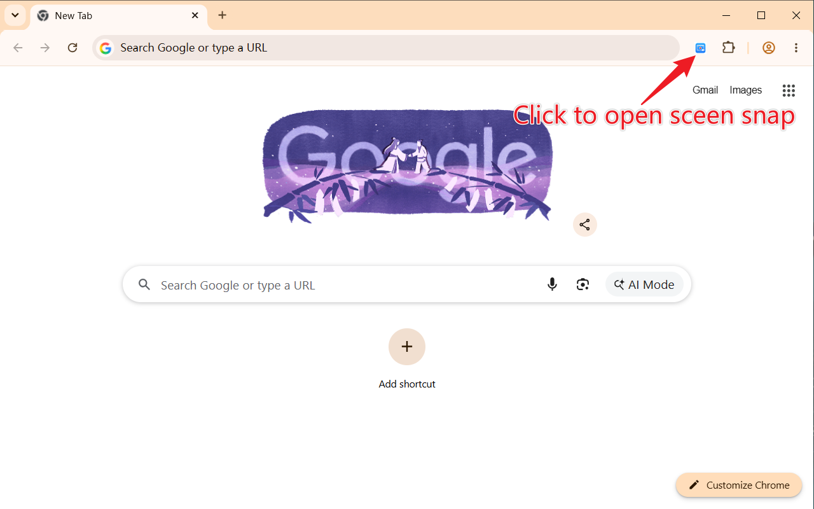
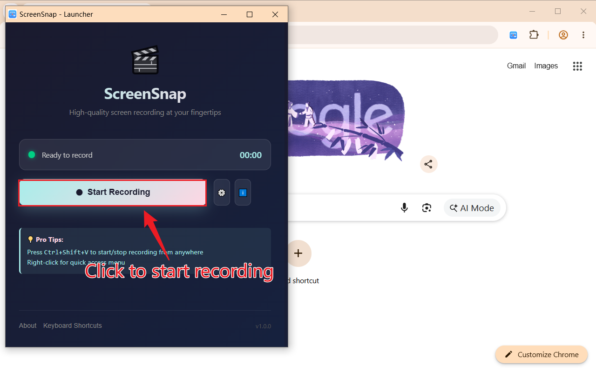
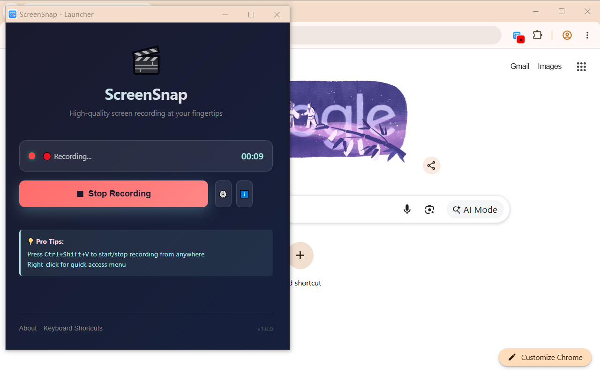

# ScreenSnap - Screen Recorder

A lightweight Chrome extension for recording your screen with audio support. Perfect for creating tutorials, demos, and presentations.

## Features

- 🎬 **Full Screen Recording** - Capture your entire screen with ease
- 🔊 **Audio Support** - Record audio along with your screen
- 🏃 **Background Operation** - Continue working while recording
- 🌐 **Multi-language Support** - English and Chinese localization
- ⚡ **Keyboard Shortcut** - Quick start/stop with Ctrl+Shift+V (Cmd+Shift+V on Mac)
- 💾 **Auto Download** - Recordings are automatically saved to your downloads folder

## Installation

1. Download or clone this repository
2. Open Chrome and navigate to `chrome://extensions/`
3. Enable "Developer mode" in the top right corner
4. Click "Load unpacked" and select the project folder
5. The ScreenSnap icon will appear in your extensions toolbar

## Usage

### Open Launcher

Click the ScreenSnap extension icon in the toolbar to open the launcher:



### Start Recording

- Press `Ctrl+Shift+V` (Windows/Linux) or `Cmd+Shift+V` (Mac)
- Or click "Start" button in the launcher
- Select the screen or window you want to record



### Stop Recording

- Press the keyboard shortcut again, or
- Click the Stop button in the interface
- Your recording will be automatically saved



## Settings

Click the ScreenSnap exte4sion icon and select "Options" to access settings:

- Choose output quality
- Set recording preferences
- Manage file naming conventions


## System Requirements

- Chrome/Chromium browser (version 88+)
- Windows, macOS, or Linux
- Microphone (optional, for audio recording)

## File Structure

```
screen-snap/
├── manifest.json           # Extension configuration
├── background.js           # Service worker
├── popup.html/js           # Main extension popup
├── options.html/js         # Settings page
├── offscreen.html/js       # Offscreen document for recording
├── launcher.html/js        # Launcher interface
├── utils.js                # Utility functions
├── config.js               # Configuration settings
├── _locales/               # Localization files
│   ├── en_US/messages.json
│   └── zh_CN/messages.json
└── imgs/                   # Image assets
```

## Permissions

ScreenSnap requests the following permissions:

- `tabCapture` - To capture tab content
- `desktopCapture` - To capture desktop
- `downloads` - To save recordings
- `offscreen` - For offscreen recording processing
- `storage` - To save preferences
- `contextMenus` - For context menu integration

## Keyboard Shortcuts

| Action           | Windows/Linux | macOS       |
| ---------------- | ------------- | ----------- |
| Toggle Recording | Ctrl+Shift+V  | Cmd+Shift+V |

## Localization

ScreenSnap supports multiple languages:

- 🇺🇸 English (en_US)
- 🇨🇳 Simplified Chinese (zh_CN)

The extension automatically detects your browser language and displays the appropriate interface.

## Troubleshooting

**Recording won't start:**

- Ensure you have granted the necessary permissions
- Try reloading the extension
- Check if another extension is blocking screen capture

**No audio in recording:**

- Verify your microphone is enabled and working
- Check permission settings for audio recording

**Large file sizes:**

- Consider using a lower quality setting in Options
- Shorter recordings produce smaller files

## Support

For issues, feature requests, or feedback, please create an issue in the repository.

## License

This project is licensed under the MIT License - see the LICENSE file for details.

## Contributing

Contributions are welcome! Please feel free to submit a Pull Request.

---

**Made with ❤️ for content creators and educators**
